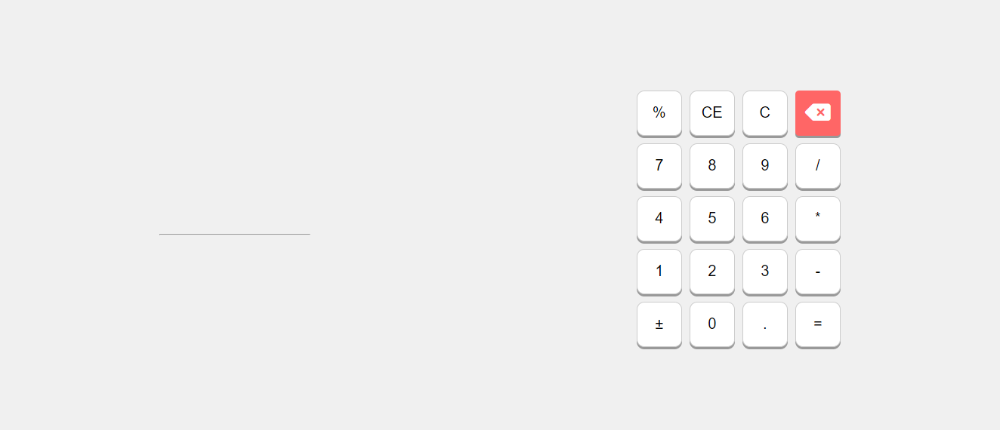

# Simple Calculator

This is a simple calculator application built using HTML, CSS, and JavaScript. It provides basic arithmetic operations such as addition, subtraction, multiplication, and division, along with percentage and decimal functionalities.

## Features

- **Basic Arithmetic Operations**: Addition, Subtraction, Multiplication, Division.
- **Additional Functions**: Percentage Calculation, Clear Entry (CE), Clear All (C), Delete Last Digit (Backspace).
- **Decimal Support**: Allows input of decimal numbers.
- **Toggle Sign**: Changes the sign of the current number (positive/negative).

## Usage

1. **Number Input**: Click on the number buttons (0-9) to input numbers.
2. **Decimal Point**: Use the decimal point (.) button to input decimal numbers.
3. **Operator Input**: Click on the operator buttons (+, -, *, /) to perform operations.
4. **Function Buttons**:
   - `%`: Calculates percentage of the current number.
   - `CE`: Clears the current entry (sNum or operator).
   - `C`: Clears all entries and resets the calculator.
   - `Backspace`: Deletes the last digit entered.
   - `±`: Toggles the sign of the current number.
5. **Equals (=)**: Clicking on the equals button calculates and displays the result in the output screen (`lblOutput`).

## Try It Out

You can try out the calculator by visiting the [Simple Calculator](https://nathija-nimantha.github.io/simple-calculator) website.

## License

This project is currently not licensed. All rights reserved.